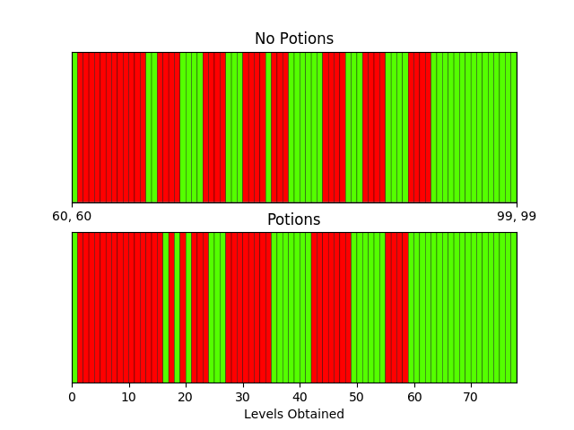

# Old School Runescape Math (osrsmath)

This project houses python code that implements various equations used in the game, primarily focused on combat mechanics. Built upon this are some applications that attempt to optimize game play or otherwise apply these equations. Having these models in a powerful programming language like Python allows novel problems to be solved. The applications are currently unpolished and not very user friendly, but here is a list of apps:


| Application        | File           | Description  |
| ------------- |:-------------:| :-----|
| Path | `apps/path.py` | For a given set of equipment: What is the most efficient way to train from a given attack and strength level to a desired level in nmz?|
| Optimize | `apps/optimize.py` | Use a genetic algorithm to find a near optimal equipment setup and/or opponent(s) for maximum experience rates. (In progress)|
| Nightmare Zone (nmz)| `apps/nmz.py` |How much experience per hour should you expect from various setups?|
| Single Opponent | `apps/single_opponent.py` | Straight forward combat analysis versus a single opponent.|

At this point in time, they don't currently provide interfaces, so you would have to edit the files, then run those scripts to use them. This will change in the future.

## Installing

To get the code, simply run
``` pip install osrsmath ```


To check that everything is working, in the command line run
```
python -m osrsmath.apps.path
```
If your environment supports graphical displays, you should get an image like:


otherwise you should at least get the saved image in the current directory.


Alternatively, since at the moment there is not interface to access the apps, you may wish instead to download the code files, run the setup script, and explore from there:
```
	git clone https://github.com/Palfore/OSRS-Combat
	cd OSRS-Combat/osrsmath
	python setup.py -e .
```
Then edit `/apps/path.py` (for example), and run `python /apps/path.py`.

## Running the tests

Coming soon!

## Built With

* [osrsbox](https://pypi.org/project/osrsbox/) - Provides Data files
* [dijkstar](https://pypi.org/project/Dijkstar/) - Implements the dijkstra Algorithm

## Authors

* **Nawar Ismail** - *Initial work* - [Palfore](https://github.com/Palfore)

<!-- See also the list of [contributors](https://github.com/your/project/contributors) who participated in this project. -->

## License

This project is licensed under the MIT License - see the [LICENSE.md](LICENSE.md) file for details

## Acknowledgments

* [OSRSBox](https://www.osrsbox.com/blog/2019/01/22/calculating-melee-dps-in-osrs/)
* [DPS Calculator by Bitterkoekje](https://docs.google.com/spreadsheets/d/1wzy1VxNWEAAc0FQyDAdpiFggAfn5U6RGPp2CisAHZW8/)
* [Forum Post by Bitterkoekje](https://web.archive.org/web/20190905124128/http://webcache.googleusercontent.com/search?q=cache:http://services.runescape.com/m=forum/forums.ws?317,318,712,65587452)
* [Overkill by Nukelawe](https://www.reddit.com/r/2007scape/comments/4d6l7j/effects_of_overkill_on_dps/)
* [Accuracy & Xp Rate Discussion by MachOSRS](https://www.reddit.com/r/2007scape/comments/40bvk6/accuracy_and_exphr_combat_formula/)
* [Accuracy Discussion](https://www.reddit.com/r/2007scape/comments/5lrty0/math_inside_corrected_accuracy_formula/)
